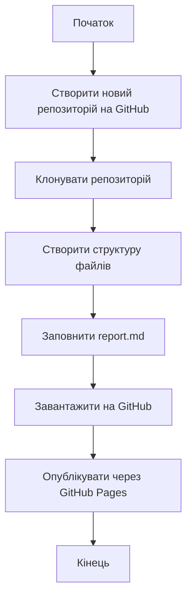

# Лабораторна робота №3 
## на тему "Markdown — створення документа, діаграми та публікація на GitHub"

Виконала:
студентка групи ІКМ-223б
Скупа В. М.
## Мета роботи
Навчитися створювати структурований документ у Markdown, додавати списки, математичні формули, діаграми (Mermaid), конвертувати Markdown у HTML / DOCX / PDF і опублікувати результат на GitHub.

## 5 улюблених книг
1. *Перевтілення* - Франц Кафка, 1912
2. *Портрет Доріана Грея* - Оскар Вайлд, 1890
3. *Так говорив Заратустра* - Фрідріх Ніцше, 1885
4. *Поза добром та злом* - Фрідріх Ніцше, 1886
5. *Я не маю рота, але мушу кричати* - Гарлан Елліпсон, 1968

## 4 математичні формули
1. Інлайн формула:  
Площа круга = $S = \pi r^2$

2. Блочна формула:

$$ a^2 + b^2 = c^2 $$

3. Ще одна формула (з логіки):

$$ \neg (A \land B) \equiv (\neg A) \lor (\neg B) $$

4. Функція:

$$ f(x) = x^2 + 2x + 3 $$

## Діаграма Mermaid

## Таблиця - інформація про книги
| Назва книги | Автор | Рік | К-сть сторінок |
|:-----------|:------------|------------:|------------:|
| Перевтілення  | Франц Кафка    | 1912   | 65 |
| Портрет Доріана Грея  | Оскар Вайлд    | 1890   | 240 |
| Так говорив Заратустра  | Фрідріх Ніцше    |  1885   | 209 |
| Поза добром та злом  | Фрідріх Ніцше    |  1886   | 199 |
| Я не маю рота, але мушу кричати | Гарлан Елліпсон | 1968 | 144 |

## Висновки
**Markdown** — легкий і дуже зручний формат для документації.
Він підтримує структурування, формули, діаграми та *легко конвертується* у PDF/HTML/DOCX.
GitHub робить Markdown ще зручнішим, бо дозволяє миттєво публікувати результати.